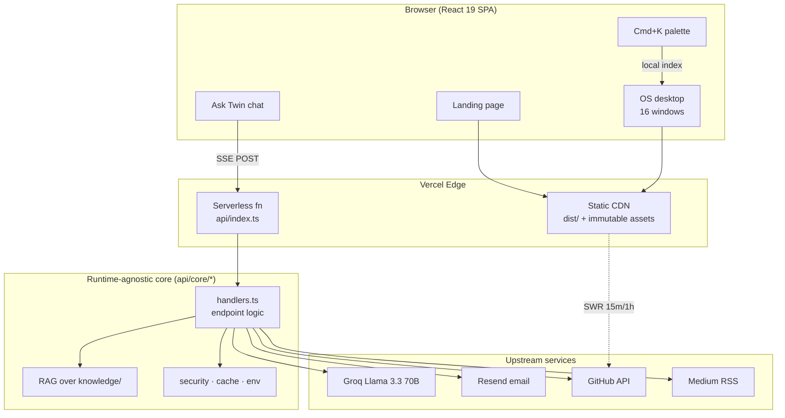
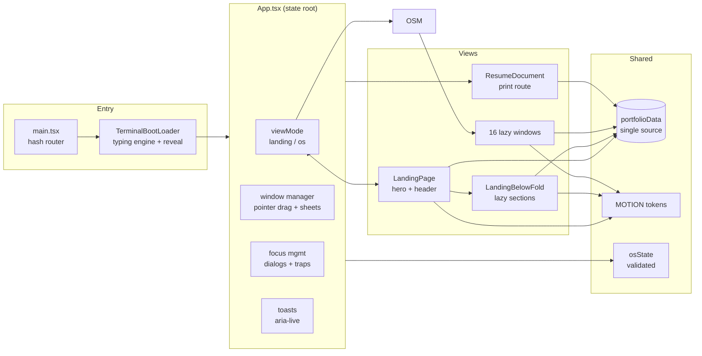
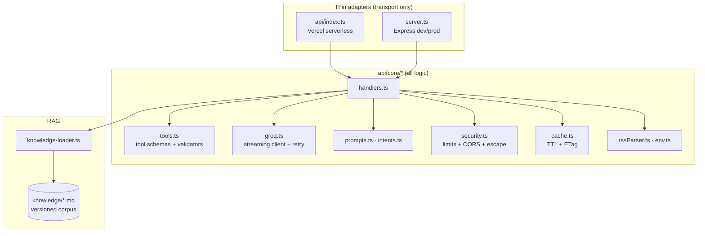
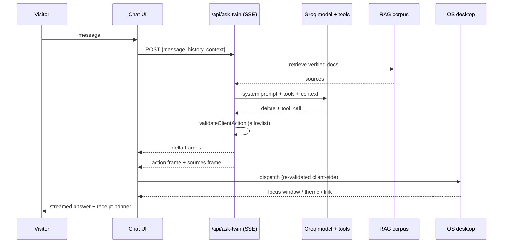
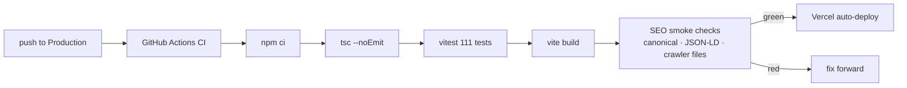

# FarhanOS

[](https://react.dev/)
[](https://vitejs.dev/)
[](https://tailwindcss.com/)
[](https://groq.com/)
[](https://vercel.com/)
[](https://github.com/9thgradeai/FarhanOS/actions)
[](https://opensource.org/licenses/MIT)

An interactive portfolio OS for clinical NLP research and full-stack AI engineering — a cinematic landing page fused with a working desktop environment operated in part by an AI twin.

**Live:** [https://farhankabir.tech](https://farhankabir.tech) · **Resume:** [farhankabir.tech/#/resume](https://farhankabir.tech/#/resume) · **Playground:** [farhankabir.tech/api/playground](https://farhankabir.tech/api/playground) · **Release:** [v2.4.0](https://github.com/9thgradeai/FarhanOS/releases/tag/v2.4.0)

---

## Table of contents

1. [Overview](#1-overview)
2. [System architecture](#2-system-architecture)
3. [Signature features](#3-signature-features)
4. [Frontend architecture](#4-frontend-architecture)
5. [Backend architecture](#5-backend-architecture)
6. [AI twin & agentic loop](#6-ai-twin--agentic-loop)
7. [Data & caching architecture](#7-data--caching-architecture)
8. [Routing & deployment topology](#8-routing--deployment-topology)
9. [Discovery, SEO & AI-search architecture](#9-discovery-seo--ai-search-architecture)
10. [Security architecture](#10-security-architecture)
11. [Motion & accessibility system](#11-motion--accessibility-system)
12. [CI/CD workflow](#12-cicd-workflow)
13. [Observability & telemetry](#13-observability--telemetry)
14. [Project structure](#14-project-structure)
15. [Getting started](#15-getting-started)
16. [Scripts reference](#16-scripts-reference)
17. [API reference](#17-api-reference)
18. [Environment variables](#18-environment-variables)
19. [Testing](#19-testing)
20. [Performance budget & techniques](#20-performance-budget--techniques)
21. [Browser support](#21-browser-support)
22. [Release history](#22-release-history)
23. [License & maintainer](#23-license--maintainer)

---

## 1. Overview

FarhanOS presents peer-reviewed publications, open-source systems, and AI engineering work inside two connected experiences:

- **Landing page** — single-page site (hero, about, skills, timelines, projects, research with plain-language findings, writings, contact) with a 3D starfield, command-bar header, and footer terminal.
- **OS mode** — a desktop with 16 draggable windows, command palette, 5 themes, floating AI assistant, and live telemetry.

Built by **Farhan Kabir** — AI Engineer, NLP Researcher, Full-Stack Developer.

---

## 2. System architecture



Self-hosted parity: `server.ts` (Express) serves `dist/` and mounts the **same** `api/core` handlers, so dev, self-hosted prod, and Vercel behave identically. Unknown `/api/*` returns JSON 404 on both; deep paths fall back to the SPA shell.

---

## 3. Signature features

| # | Feature | How it works |
|---|---------|--------------|
| 1 | Boot-to-desktop continuity | Boot script ends in `farhanos --boot desktop`; terminal scales up and dissolves while the desktop scales in (one easing curve, reduced-motion safe) |
| 2 | Twin operates the portfolio | Model function-calls → allowlist validation (server + client) → SSE action frames → real window/theme/link dispatch with in-chat receipts |
| 3 | Search-first navigation | Hero `K` pill, `Cmd/Ctrl+K` + bare-`K` shortcuts, `#/w/&lt;window&gt;` deep links |
| 4 | Live telemetry | `GET /api/health` (node + vercel runtimes) → status chips + Telemetry window |
| 5 | RAG transparency | Citations render as clickable verified-source chips opening the mapped window |
| 6 | Printable resume | `#/resume` from live `portfolioData`, boot skipped on direct entry, `@page` print CSS |
| 7 | Playground API | Read-only `/api/playground[/papers\|/repos]`, 30 req/hr, edge-cached |
| 8 | Release-notes ritual | Versioned `buildLogs` rendered in the Builds window |

---

## 4. Frontend architecture



### Window manager
- **Pointer Events** drag (mouse/touch/stylus) with pointer capture, clientX/Y deltas, and rAF-throttled commits (one render per frame).
- Desktop: clamped free positioning, re-clamped on resize/rotate, sanitized persisted layouts.
- Mobile (<768px): bottom-sheet metaphor — grab handle, sheet chrome, swipe-down-to-minimize.
- Windows are `role=dialog` with DOM focus moved on open/restore/close; command palette is focus-trapped with focus restore.

### Persistence (`farhanos:state:v1`)
Validated schema — theme allowlist, ≤20 window IDs, finite bounded coordinates, 100KB write cap, 250ms debounced writes. Corrupt storage falls back to defaults; it can never crash the window manager.

### Content modules
Projects Explorer (16) · Publications Reader (6 papers + findings + BibTeX copy) · Career/Pro timelines · Skills Observatory · Concept Garden (keyboard-operable) · Resume Gen · Mission Brief · Whiteboard · Builds · Telemetry · Settings.

---

## 5. Backend architecture



Design rules: adapters contain zero business logic; every endpoint exists on both runtimes with identical contracts; money-spending and secret-touching paths are never exposed read-only.

---

## 6. AI twin & agentic loop



- Max **4 tool turns** per request; client actions: `open_os_window` (16-ID enum), `switch_os_theme` (5-theme enum), `open_external_link` (exact-URL allowlist + owned-repo paths only).
- Groq client retries transient failures (4 attempts, 2s/5s/9s backoff); the frontend retries once only when nothing was delivered and no action fired (side-effect safe).
- Fallbacks: local canned responder + client TTS (Web Speech) when the backend is unreachable; TTS honors mute.

---

## 7. Data & caching architecture

Three tiers, fastest first:

| Tier | Mechanism | Policy |
|------|-----------|--------|
| Edge CDN | `Cache-Control: public` + `stale-while-revalidate=86400` | Medium 15 min · GitHub 60 min · playground 60 min |
| Server memory | `cache.ts` TTL + ETag/Last-Modified + 304 handling | Medium 15 min · GitHub 60 min |
| Client | Static `portfolioData` fallbacks, idle-prefetched | Instant render, then live refresh |

Static portfolio data (`src/data/portfolioData.ts`, typed by `src/types.ts`) is the single source of truth for projects, papers (+takeaways), timelines, skills, build logs, and certifications — it feeds the landing, OS windows, resume route, and playground API simultaneously.

---

## 8. Routing & deployment topology

| Route | Behavior |
|-------|----------|
| `/` | Single canonical page (only indexable URL) |
| `#/resume` | Printable resume (boot skipped on direct entry) |
| `#/w/<window>` | Deep link into an OS window (16 IDs) |
| `#<section>` | Landing anchors (about/skills/projects/research/…) |
| `/api/*` | Adapters → core handlers; unknown paths JSON 404 (any method) |
| `/robots.txt`, `/sitemap.xml`, `/llms.txt`, `/og-image.png`, `/<indexnow-key>.txt` | Served before SPA fallback |

`vercel.json`: `/api/*` rewrite, www→apex 301, `cleanUrls`, `trailingSlash: false`, security headers, crawler-file and immutable-asset caching. Express mirrors the same headers and guarantees. Verified live via boot-and-curl matrix (200s, JSON 404s, header presence, SPA fallback).

---

## 9. Discovery, SEO & AI-search architecture

- **Canonical discipline**: exactly one indexable URL; anchors never enter sitemaps; `/api/` disallowed.
- **Metadata**: unique title/description, canonical, robots directives, OG + `summary_large_image` Twitter card (1200×630 locally-rendered PNG), verification placeholders.
- **Structured data**: Person (role, `knowsAbout`, verified `sameAs`) + WebSite + ProfilePage graph in JSON-LD.
- **Instant indexing**: IndexNow key + `npm run seo:submit-indexnow` (verified HTTP 200).
- **AI readability**: semantic landmarks, single H1, hierarchical H2/H3, plain-language paper findings, `llms.txt` (sections, profiles, playground API).
- Manual submission runbook: `SEARCH-SUBMISSION-CHECKLIST.md` (Bing 5-for-1, Scholar/ORCID, Brave). Design record: `SEO-AI-IMPLEMENTATION.md`.

---

## 10. Security architecture

| Control | Implementation |
|---------|----------------|
| Rate limiting | ask-twin 20/min · summarize 10/min · contact 5/min · playground 30/hr · global 120/min (fixed-window, per-IP,ussein-memory, swept at 10k buckets) |
| CORS | Origin allowlist + `Vary: Origin`; `content-type` only |
| Input validation | Payload caps (128KB JSON), email format, length clamps, validated urgency icon (forgery-proof subjects) |
| Output safety | HTML escaping in emails, `noopener noreferrer` externals, validated model actions |
| Delivery resilience | Resend 3-attempt retry (500ms/1.5s backoff); 429/5xx + network retry, 4xx fail-fast |
| Transport | Security headers (nosniff, `DENY` framing, strict referrer, locked-down permissions), Brotli q11 + gzip 9, no secrets in client bundle |

---

## 11. Motion & accessibility system

- **One dialect**: `src/utils/motion.ts` — `cubic-bezier(0.22, 1, 0.36, 1)` easing, `springSoft` (300/20) reveals, `springSnappy` (400/20) interactions, once-only `-80px` viewport reveals.
- **Reduced motion** honored in boot, typewriters, scroll, 3D (static frame + chunk still deferred), and infinite animations.
- **Keyboard**: skip links, trapped dialogs, palette + window focus orchestration, visible focus rings, 44px targets, labelled/autocompleted forms.
- **Screen readers**: aria-live announcer + toasts + action receipts, dialog semantics, hidden decorative tickers (clock), table scopes, capped markdown heading levels.

---

## 12. CI/CD workflow



Releases are cut as GitHub tags (`v2.4.0`) with narrative notes that mirror the in-app Builds window.

---

## 13. Observability & telemetry

- `GET /api/health` → `{status, runtime, uptimeSeconds?, time}` (JSON, `no-store`).
- `ApiStatusChip` (idle-deferred, single-shot, honest offline state) in footer + OS bar.
- Telemetry window: API latency, session uptime ticker, visit count, open windows, theme, analytics mode, build stamp — all measured live.

---

## 14. Project structure

```
├── api/
│   ├── index.ts              # Vercel adapter (+ playground/health branches)
│   ├── knowledge-loader.ts   # RAG loader (Node fs)
│   └── core/                 # handlers · tools · groq · prompts · intents
│                             # security · cache · rssParser · env
├── server.ts                 # Express adapter (dev + prod, JSON 404s)
├── scripts/                  # submit-indexnow.mjs · generate-og-image.py
├── knowledge/                # RAG corpus (profile/projects/research/…)
├── public/                   # robots · sitemap · llms.txt · og-image.png
│                             # indexnow key · fonts · research-images
├── src/
│   ├── App.tsx               # modes, window manager, palette, toasts
│   ├── main.tsx              # entry (+ resume-route boot skip)
│   ├── os/windows/           # 16 lazy windows (incl. TelemetryWindow)
│   ├── components/           # Landing · boot · chat · resume · chips
│   ├── hooks/                # useTerminalBoot · useFocusTrap · useApiHealth
│   ├── utils/                # osActions · osState · sound · motion · analytics
│   ├── config/               # site · terminalCommands
│   └── data/portfolioData.ts # single source of truth
├── .github/workflows/ci.yml
├── SEO-AI-IMPLEMENTATION.md
├── SEARCH-SUBMISSION-CHECKLIST.md
└── vercel.json
```

---

## 15. Getting started

Prerequisites: **Node.js 24**, npm.

```bash
npm install          # or npm ci (reproducible)
cp .env.example .env # fill GROQ_API_KEY / RESEND_API_KEY
npm run dev          # http://localhost:3001
```

---

## 16. Scripts reference

| Script | Purpose |
|--------|---------|
| `npm run dev` | Express + Vite dev server |
| `npm run build` / `vercel-build` | Production build → `dist/` |
| `npm run start` | Serve `dist/` with Express |
| `npm run lint` | `tsc --noEmit` |
| `npm test` / `test:watch` | Vitest suite |
| `npm run seo:submit-indexnow` | Notify engines post-deploy (key must be live) |

---

## 17. API reference

Base path: `/api`. All unknown paths → `{ "error": "API endpoint not found" }` (404, any method).

| Endpoint | Contract |
|----------|----------|
| `POST /api/ask-twin` | `{message, history[], context?}` → SSE (`delta`, `sources`, `followups`, `action` frames, `[DONE]`) |
| `POST /api/summarize-brief` | `{projectType, budget, timeline, goals, comments}` → `{summary}` |
| `GET /api/medium-stories` | Cached stories + ETag/304 (15m + SWR) |
| `GET /api/github-repos` | Top-10 by stars + ETag/304 (60m + SWR) |
| `POST /api/contact` | Validated brief → AI analysis → Resend (retry) → `{analysis, emailStatus}` |
| `GET /api/health` | `{status, runtime, uptimeSeconds?, time}` |
| `GET /api/playground` | Self-documenting index (30/hr) |
| `GET /api/playground/papers` | 6 papers + findings + citations |
| `GET /api/playground/repos` | Trimmed cached repo list |

---

## 18. Environment variables

| Variable | Required | Description |
|----------|----------|-------------|
| `GROQ_API_KEY` | Yes | Completions + brief/contact analysis |
| `RESEND_API_KEY` | Yes | Contact delivery |
| `GITHUB_TOKEN` | No | Raises GitHub limit (fine-grained, public-read) |
| `VITE_PLAUSIBLE_DOMAIN` | No | Analytics on (unset = silent no-op) |
| `VITE_API_URL` | No | API base override (default same-origin) |
| `PORT` | No | Server port (default `3001`) |

Secrets live in the Vercel dashboard — never in the repo.

---

## 19. Testing

Vitest suite — 9 files, 111 tests, all green: handlers (validation, contact pipeline incl. retry shapes, sanitization), security (rate-limit buckets, CORS, escaping), groq client (retry/backoff), intents, tools (action validators), RSS parser, knowledge loader. CI runs the full suite plus typecheck, build, and SEO smoke checks on every push.

---

## 20. Performance budget & techniques

- Route-level code splitting (`vendor`/`three`/`motion`/`icons` manual chunks) + 16 lazy windows + lazy below-fold (`rootMargin: 300px`) + lazy 3D.
- Mobile skips WebGL; AVIF/WebP responsive images with dimensions; all 4 font cuts preloaded.
- rAF-throttled drag, idle-deferred telemetry/probes, 30ms sound throttle, 60ms SSE delta batching.
- Compression: Brotli quality 11 (`LGWIN` 22) + gzip 9, 1KB threshold. `esbuild.pure` strips debug logging; no sourcemaps in prod.

---

## 21. Browser support

Chrome/Edge 90+, Firefox 88+, Safari 14+, Mobile Safari 14+, Chrome for Android. ES2022, `react-jsx` transform.

---

## 22. Release history

| Version | Highlights |
|---------|------------|
| v2.4.0 | Tiers 1–3: twin tools, telemetry, IndexNow, contact retry, telemetry window |
| v2.3.0 | UX audit remediation (pointer drag, dialogs, toasts, validated state) |
| v2.2.0 | SEO foundation (canonical, crawlers, schema, verification readiness) |
| v1.4.2 / v1.3.0 | Voice synthesis, command palette & context engine |

Full narrative in-app: Builds window. GitHub: [Releases](https://github.com/9thgradeai/FarhanOS/releases).

---

## 23. License & maintainer

MIT — **Farhan Kabir** · [farhankabir.tech](https://farhankabir.tech) · [GitHub](https://github.com/farhankabir133) · [LinkedIn](https://www.linkedin.com/in/farhankabir133) · farhankabir133@gmail.com
